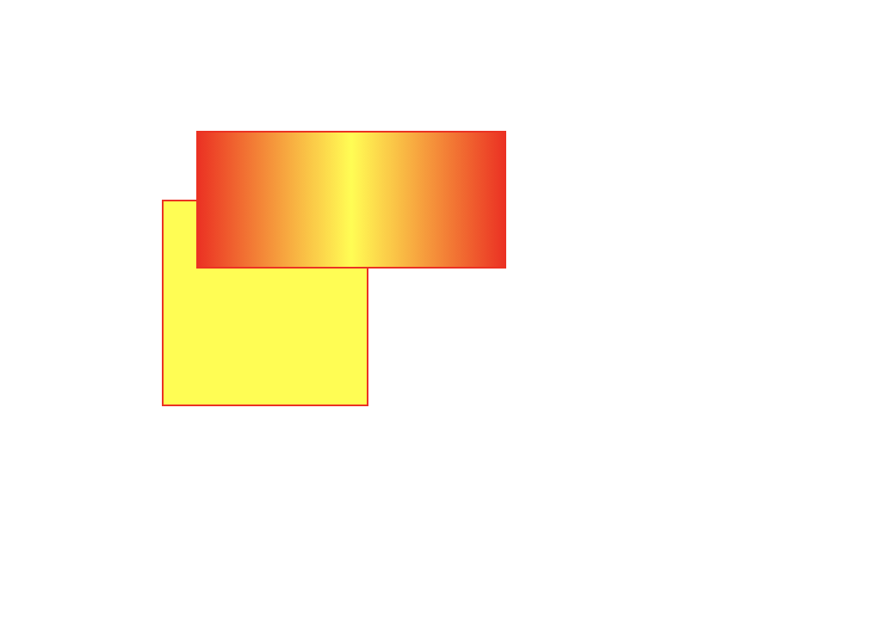

# Drawing with CSS

Normally, HTML content is displayed from top to bottom one by one. But we can use CSS to customize the placement of each HTML element. The technique is to use the `position` property. When you set an element `position: absolute;`, you can now set its position relative to the entire page, not having to follow the order in the HTML. It works almost exactly like how you draw shapes in Photoshop/Illustrator. The origin (top: 0 and left: 0) is the top-left corner. From there, try different values. Below are two simple examples:


```html
<div class="box-1"></div>
<div class="box-2"></div>
```

```css
/* position absolute allows us to position anywhere. */
div {
  position: absolute; 
}

/* use class selector to target individual elements. */
.box-1 {
  border:  1px solid red;
  /* set width, height, background to display shape */
  width: 200px;
  height: 200px;
   background: yellow;
  /* set top and left to set position (top and left works because we set div position to absolute) */
  top: 100px;
  left: 200px;

}
.box-2 {
  border: 2px dashed teal;
  width: 120px;
  height: 40px;
  top: 80px;
  left: 320px;
}
```


```css
div {
  position: absolute;
  box-sizing: border-box;
}

.box-1 {
  border: 1px solid red;
  width: 120px;
  height: 120px;
  top: 120px;
  left: 100px;
  background-color: yellow;
}
.box-2 {
  border: 1px solid red;
  width: 180px;
  height: 80px;
  top: 80px;
  left: 120px;
  background: -webkit-linear-gradient(left, #FF0000 0%, #FFFF00 50%, #ff0000 100%); 
}
```



We can do something more complex:

```html
<div class="background">
</div>

<div class="one g-1">
  <div class="two">
    <div class="three">
      <div class="four">
        <div class="five">
        </div>
      </div>
    </div>
  </div>
</div>

<div class="one g-2">
  <div class="two">
    <div class="three">
      <div class="four">
        <div class="five">
        </div>
      </div>
    </div>
  </div>
</div>

<div class="one g-3">
  <div class="two">
    <div class="three">
      <div class="four">
        <div class="five">
        </div>
      </div>
    </div>
  </div>
</div>

<div class="one g-4">
  <div class="two">
    <div class="three">
      <div class="four">
        <div class="five">
        </div>
      </div>
    </div>
  </div>
</div>
```

```css
div {
  box-sizing: border-box;
}

.background {
  width: 400px;
  height: 400px;
  position: absolute;
  top: 50px;
  left: 80px;
  background-color: hsl(100, 50%, 80%);
  border: 20px solid hsl(120, 50%, 70%);
}

.g-1 {
  position: absolute;
  top: 200px;
  left: 100px;
}
.g-2 {
  position: absolute;
  top: 120px;
  left: 20px;
}
.g-3 {
  position: absolute;
  top: 10px;
  left: 240px;
  transform: rotate(45deg);
}
.g-4 {
  position: absolute;
  top: 240px;
  left: 360px;
  transform: rotate(135deg);
}

.one {
  width: 200px;
  height: 200px;
  border-left: 20px solid black;
  border-right: 20px solid red;
  border-top: 20px solid yellow;
  border-bottom: 20px solid green;
}
.two {
  width: 160px;
  height: 160px;
  border-left: 20px solid red;
  border-right: 20px solid yellow;
  border-top: 20px solid green;
  border-bottom: 20px solid blue;
}
.three {
  width: 120px;
  height: 120px;
  border-left: 20px solid brown;
  border-right: 20px solid green;
  border-top: 20px solid black;
  border-bottom: 20px solid orange;
}
.four {
  width: 80px;
  height: 80px;
  border-left: 20px solid teal;
  border-right: 20px solid pink;
  border-top: 20px solid ivory;
  border-bottom: 20px solid yellowgreen;
}
.five {
  width: 40px;
  height: 40px;
  background-color: black;
}

```
