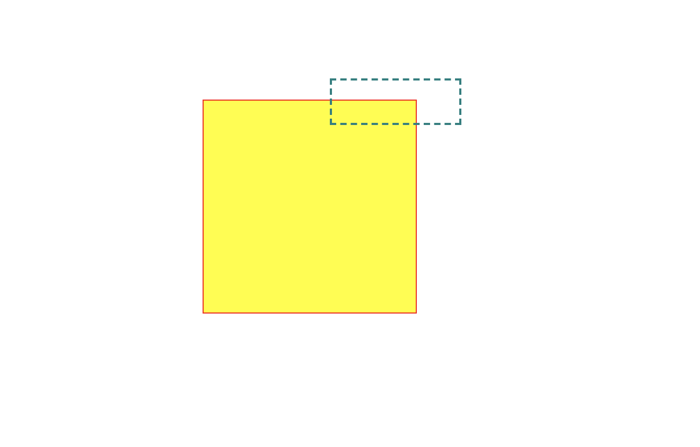

# Drawing with CSS

```html
<div class="box-1"></div>
<div class="box-2"></div>
```

```css
/* position absolute allows us to position anywhere. */
div {
  position: absolute; 
}
div.box-1 {
  border:  1px solid red;
  /* set width, height, background to display shape */
  width: 200px;
  height: 200px;
   background: yellow;
  /* set top and left to set position (top and left works because we set div position to absolute) */
  top: 100px;
  left: 200px;

}
div.box-2 {
  border: 2px dashed teal;
  width: 120px;
  height: 40px;
  top: 80px;
  left: 320px;
}
```




```css
div {
  position: absolute;
  box-sizing: border-box;
}

div.box-1 {
  border: 1px solid red;
  width: 120px;
  height: 120px;
  top: 120px;
  left: 100px;
  background-color: yellow;
}
div.box-2 {
  border: 1px solid red;
  width: 180px;
  height: 80px;
  top: 80px;
  left: 120px;
  background: -webkit-linear-gradient(left, #FF0000 0%, #FFFF00 50%, #ff0000 100%); 
}
```
