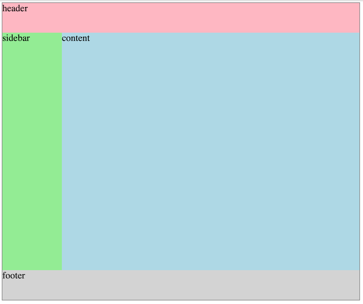

# CSS Grid Basics
CSS Grid is a great way to design a page layout, particularly, for 2 dimensional, more complex layout. If you have multiple columns and rows that need to align to each other, css grid can be a great technique to use.

Let's take a look at a simple example that we will build:



```html
<div class="container">
  <div class="header">header</div>
  <div class="sidebar">sidebar</div>
  <div class="content">content</div>
  <div class="footer">footer</div>
</div>
```

## Grid Line

### `display: grid;`
To use css grid, you need to first set the parent container to `display: grid`. The name of the class here does not matter. I am simply calling it `container` but you can call it whatever you want as long as you can select and style it.

```css
.container {
  outline: 1px solid gray;
  width: 600px;
  display: grid;
}
```

Once you set the container to `grid`, all the **immediate children** become grid *items*. We will continue to define the grid on the container. We want to define how many rows and columns there are in the grid as well as the size for each.

From the image above, we know that we need 2 columns x 3 rows. So let's define them. 

```css
.container {
  ...
  grid-template-columns: 100px 500px;
  grid-template-rows: 50px 400px 50px;
}

.header {
  background-color: lightpink;
}
.sidebar {
  background-color: lightgreen;
}
.content {
  background-color: lightblue;
}
.footer {
  background-color: lightgray;
}
```

### `grid-column` and `grid-row`
Now, you need to tell each grid item how many columns/rows it should occupy. For this, we will use `grid-column` and `grid-row` on *children* elements. The line that divides each column/row is called grid line. the first (either top or left) grid line is numbered `1`. So in our example, the header element starts at column 1 (first vertical line) to 4 (last vertical line), and row 1 (top horizontal line) to 2 (one right below).

```css
.header {
  grid-column: 1 / 3;
  grid-row: 1 / 2;
}
```

There are a few different ways of setting the start/end grid line. 

```css
.header {
  grid-column: 1 / -1; /* -1 means the last grid line no matter how many column/row there may be. */
}

.header {
  grid-column: 1 / span 2; /* start at 1 and span across 2 grid tracks. */
}

.header {
  grid-column: span 2; /* start from where it currently is and span across 2 grid tracks. */
}
```

Using one of the ways from above, set the rest of the elements.

*Exercise: Can you move the sidebar to the right? Can you change the height of the sidebar?*

### `grid-gap`

If you need *margins* between each column/row, use `grid-gap` property. It takes two values - first row gap, second column gap:

```css
  grid-gap: 10px 20px; /* row-gap column-gap */
```

If you apply `grid-gap`, then your contents will overflow out of the container. That is because the gap is added after calculating the size of each element. To prevent, instead of using pixel values for `grid-template-columns`, use `fr`.

To rewrite the above:
```css
.container {
  ...
  /* grid-template-columns: 100px 500px; */
  grid-template-columns: 1fr 5fr; /* fraction units will only account for available space. */
  grid-template-rows: 50px 400px 50px;
}
```

### 12-column grid template

Instead of just creating 2 columns, let's create 12 column grid, which will give us more flexibility. To define 12 columns, we will need to provide 12 values to `grid-template-columns` as below:

```css
  grid-template-columns: 50px 50px 50px 50px 50px 50px 50px 50px 50px 50px 50px 50px;
```

That's a lot of values - if we are simply repeating the same values, we can use `repeat()` function.

### `repeat()`

```css
.container {
  outline: 1px solid gray;
  width: 600px;
  display: grid;
  grid-template-columns: repeat(12, 50px); /* create 12 columns each at 50px wide*/
  grid-template-rows: 50px 400px 50px;
}
```

To create the same layout as above, but now with 12 columns:

```css
.header {
  background-color: lightpink;
  grid-column: span 12;
  grid-row: 1 / 2;
}
.sidebar {
  background-color: lightgreen;
  grid-column: span 3;
  grid-row: 2 / 3;
}
.content {
  background-color: lightblue;
  grid-column: span 9;
}
.footer {
  background-color: lightgray;
  grid-column: 1 / -1;
  grid-row: 3 / 4;
}
```

### What if I don't know the height of my grid rows?

Instead of definining `grid-template-rows` for each row, we can let the content dictate the actual height. It makes sense because we can't guarantee how long our contents will be all the time. Also, the new rows may be created automatically as needed. Check more info on [w3schools' grid-template-rows](https://www.w3schools.com/CSSref/pr_grid-template-rows.asp) on other ways of setting up the template.

Or, maybe you want to keep header/footer with fixed height, but you want the content to determine the height of main areas:

```css
grid-template-rows: 50px auto 50px;
```

## Grid Area

Instead of using grid lines, we can define grid areas. Check out [MDN Grid Template Areas](https://developer.mozilla.org/en-US/docs/Web/CSS/CSS_Grid_Layout/Grid_Template_Areas) for more info.

```css
.container {
  outline: 1px solid gray;
  width: 600px;
  display: grid;
  grid-template-areas: 
    "h h h h h h h h h h h h"
    "s s s c c c c c c c c c"
    "f f f f f f f f f f f f";
}

.header {
  background-color: lightpink;
  height: 50px;
  grid-area: h;
}
.sidebar {
  background-color: lightgreen;
  height: 400px;
  grid-area: s;
}
.content {
  background-color: lightblue;
  grid-area: c;
}
.footer {
  background-color: lightgray;
  height: 50px;
  grid-area: f;
}
```

If you need an empty cell in template areas, use `.`.

```css
  grid-template-areas: 
    "h h h h h h h h h h h h"
    "s s s . c c c c c c c c"
    "f f f f f f f f f f f f";
```

*Exercise: Find a website that uses multi-column layout and recreate its main structure using simple colored `<div`s. You don't need to recreate every single little details. Just focus on getting the main, overall structure.*
