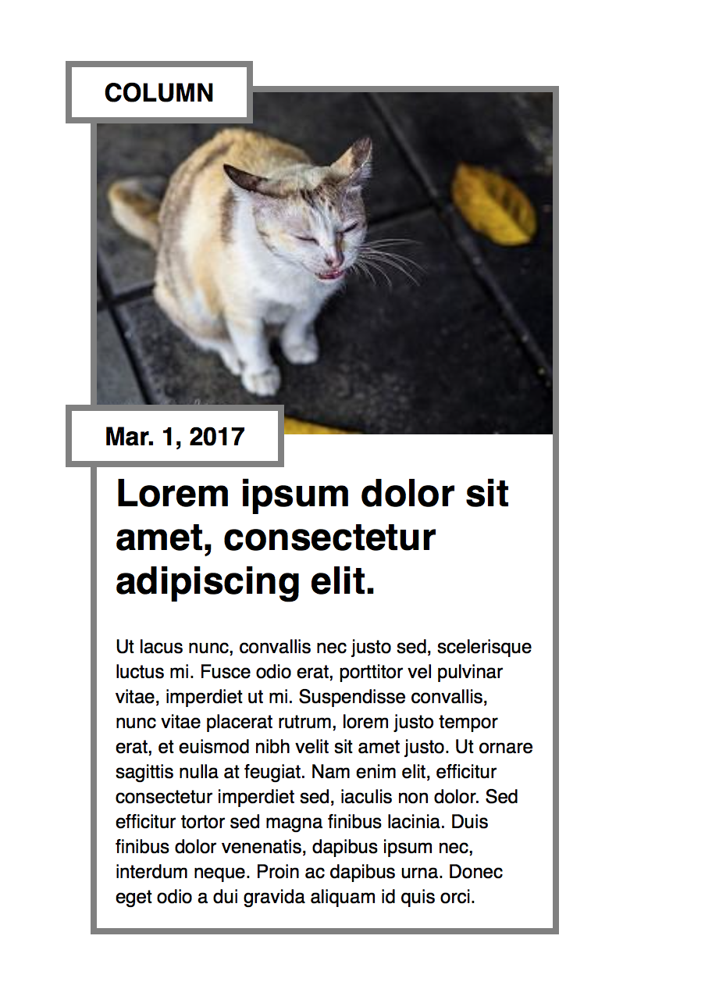
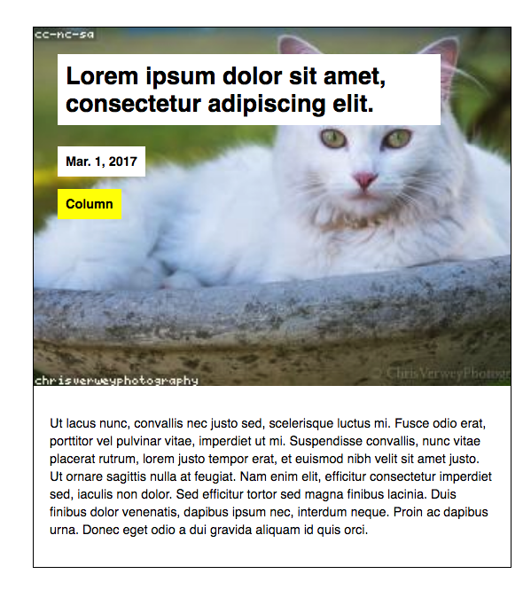

# CSS Position Exercise

Use the HTML below, and **do not change anything from the HTML** (no changing order, no new elements).

```html
<div class="article">
  <div class="category">Column</div>
  <div class="date">Mar. 1, 2017</div>
  
  <h2>Lorem ipsum dolor sit amet, consectetur adipiscing elit.</h2>
  <p>Ut lacus nunc, convallis nec justo sed, scelerisque luctus mi. Fusce odio erat, porttitor vel pulvinar vitae, imperdiet ut mi. Suspendisse convallis, nunc vitae placerat rutrum, lorem justo tempor erat, et euismod nibh velit sit amet justo. Ut ornare
    sagittis nulla at feugiat. Nam enim elit, efficitur consectetur imperdiet sed, iaculis non dolor. Sed efficitur tortor sed magna finibus lacinia. Duis finibus dolor venenatis, dapibus ipsum nec, interdum neque. Proin ac dapibus urna. Donec eget odio
    a dui gravida aliquam id quis orci.</p>
</div>
```


And add your own CSS to create the result as below.

A few tips:
- start from parent elements and go into children elements. And block out boxes first before worrying about smaller details.
- Use box model (width, height, padding, border, margin)
- You need to decide what position property to use: `relative` or `absolute`.
- If an element keeps its original space, use `relative`.
- If the original space gets taken over by other elements, use `absolute`.

## 1

 

## 2

 
